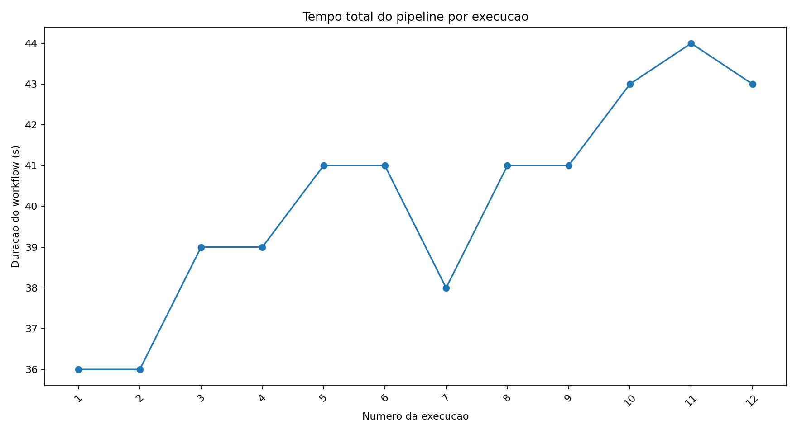
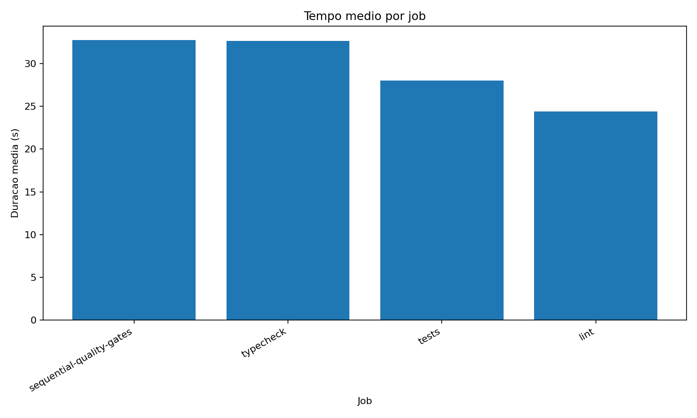
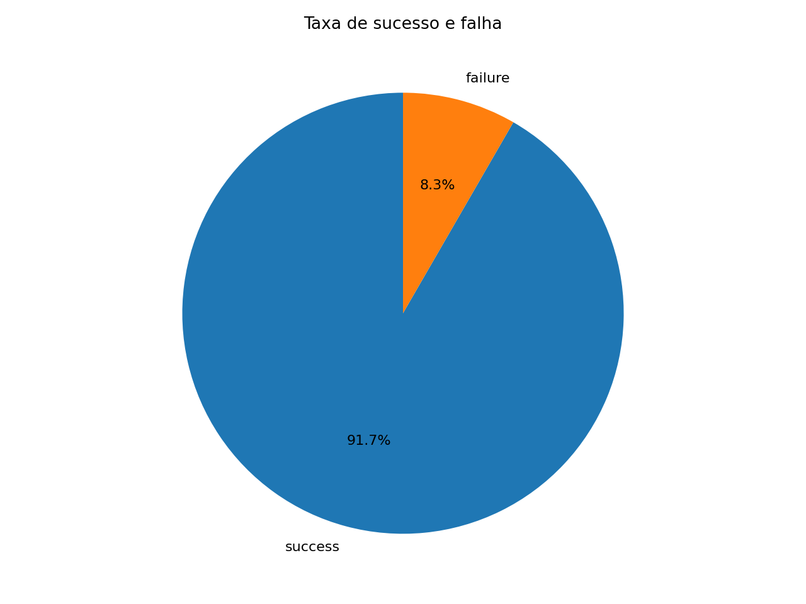
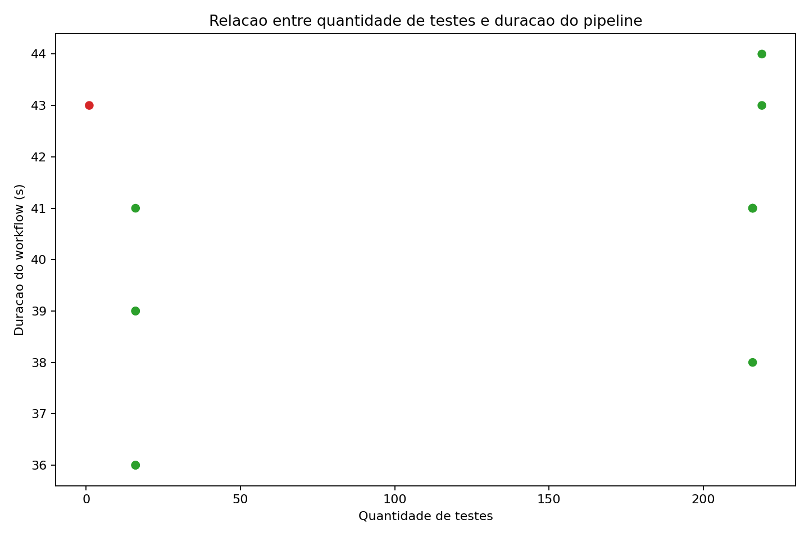

# Relatorio Tecnico: Analise de Metricas de Pipeline CI/CD

## 1. Contexto

Este experimento mede o comportamento de um pipeline CI/CD implementado no GitHub Actions. O repositorio contem um projeto Python pequeno, mas com gates reais de qualidade: instalacao de dependencias, lint, type checking, testes automatizados, geracao de artefatos e coleta automatizada de metricas.

O objetivo e comparar execucoes reais com variacoes controladas de cache, paralelismo, volume de testes, testes lentos e falhas controladas.

## 2. Links principais

- Repositorio GitHub: `PREENCHER_COM_LINK_DO_REPOSITORIO`
- Workflow YAML: `PREENCHER_COM_LINK_DO_CI_YML`
- Script de coleta: `scripts/collect_metrics.py`
- Base CSV: `data/pipeline_metrics.csv`
- Base JSON: `data/raw_runs.json`
- Matriz de execucoes: `experiments/run_matrix.csv`

## 3. Hipoteses iniciais

1. O cache de dependencias deve reduzir pouco o tempo total, pois o projeto e pequeno e o custo dominante esperado esta nos testes.
2. O paralelismo entre jobs deve reduzir o tempo total em perfis mais longos, mas pode ter ganho baixo no perfil rapido devido ao overhead de inicializacao.
3. A quantidade de testes deve ter correlacao positiva com a duracao, mas testes lentos artificiais devem impactar mais do que muitos testes rapidos parametrizados.
4. Falhas que ocorrem cedo devem reduzir o tempo ate feedback, especialmente em lint/typecheck.

## 4. Desenho do experimento

O workflow `.github/workflows/ci.yml` possui quatro parametros:

- `cache_mode`: `enabled` ou `disabled`
- `execution_mode`: `sequential` ou `parallel`
- `test_profile`: `fast`, `expanded`, `slow` ou `failing`
- `pytest_workers`: `1` ou `auto`

A matriz planejada possui 14 execucoes, documentadas em `experiments/run_matrix.csv`. As principais variacoes sao:

- baseline sequencial sem cache;
- execucoes com cache habilitado;
- execucoes com jobs paralelos;
- aumento artificial da quantidade de testes;
- introducao de testes lentos;
- execucao com `pytest-xdist`;
- falhas controladas de teste e lint.

## 5. Evidencias reais de execucao

> Esta secao deve ser preenchida apos executar o workflow no GitHub Actions.

| Run ID | Link | Commit | Mensagem | Variacao | Status |
| --- | --- | --- | --- | --- | --- |
| PREENCHER | PREENCHER | PREENCHER | PREENCHER | PREENCHER | PREENCHER |

## 6. Metricas coletadas

O script `scripts/collect_metrics.py` consulta a API do GitHub Actions e baixa os artefatos de teste quando disponiveis. A base final contem, no minimo:

- ID do workflow run;
- SHA do commit;
- mensagem resumida do commit;
- status da execucao;
- duracao total do workflow;
- nome e duracao de cada job;
- nome e duracao de etapas relevantes;
- quantidade de testes;
- quantidade de falhas;
- tempo total e medio dos testes;
- timestamp da execucao;
- variacao experimental inferida.

## 7. Graficos

> Inserir os graficos gerados apos rodar `make charts`.

### 7.1 Tempo total do pipeline por execucao

### 7.2 Tempo por job

### 7.3 Taxa de sucesso e falha

### 7.4 Quantidade de testes vs duracao

## 8. Analise dos resultados

> Esta secao deve ser fechada com os dados reais coletados.

### 8.1 Qual etapa mais contribuiu para o tempo total?

PREENCHER com base no grafico de duracao por job e nas etapas do workflow.

### 8.2 Houve diferenca significativa entre execucoes com e sem cache?

PREENCHER comparando runs com `cache_mode=enabled` e `cache_mode=disabled` sob o mesmo perfil.

### 8.3 O paralelismo reduziu o tempo total?

PREENCHER comparando `execution_mode=sequential` e `execution_mode=parallel`, principalmente nos perfis `expanded` e `slow`.

### 8.4 Quais falhas foram mais frequentes?

PREENCHER considerando as falhas controladas e qualquer falha inesperada.

### 8.5 O pipeline fornece feedback rapido o suficiente?

PREENCHER usando a duracao media e a duracao dos runs falhos.

### 8.6 Melhorias possiveis

Possiveis melhorias a validar:

- separar instalacao de dependencias de execucao de testes quando houver build mais pesado;
- usar matriz de Python somente se houver necessidade real de compatibilidade;
- manter testes lentos isolados por marcador;
- monitorar cache hit/miss explicitamente;
- bloquear merges quando artefatos de teste nao forem gerados.

## 9. Resultados inesperados

> O relatorio final deve discutir pelo menos dois resultados inesperados.

1. PREENCHER resultado inesperado 1.
2. PREENCHER resultado inesperado 2.

## 10. Comparacao entre hipotese e resultado observado

| Hipotese | Resultado observado | Confirmada? |
| --- | --- | --- |
| Cache reduz pouco o tempo total | PREENCHER | PREENCHER |
| Paralelismo ajuda mais em suites longas | PREENCHER | PREENCHER |
| Testes lentos pesam mais que muitos testes rapidos | PREENCHER | PREENCHER |
| Falhas cedo reduzem tempo de feedback | PREENCHER | PREENCHER |

## 11. Limitacoes

Limitacoes esperadas do experimento:

- GitHub-hosted runners variam em carga e podem introduzir ruido.
- O projeto e pequeno, entao o impacto de cache de dependencias pode ser menor que em sistemas reais.
- A quantidade de execucoes e suficiente para analise didatica, mas limitada para inferencia estatistica robusta.
- Testes lentos foram introduzidos de forma controlada, portanto simulam gargalo, mas nao representam necessariamente IO ou rede reais.
- O coletor depende da disponibilidade dos artefatos do workflow.

## 12. Como a analise apoia decisoes de engenharia

A analise permite decidir se vale a pena investir em paralelismo, cache ou reorganizacao dos gates. Tambem ajuda a diferenciar otimizacoes com efeito real de mudancas que apenas aumentam complexidade do pipeline. Em um time, esse tipo de medicao reduz decisoes baseadas em percepcao e orienta melhorias pelo gargalo dominante.

## 13. Como reproduzir

1. Clonar o repositorio.
2. Instalar dependencias com `make install`.
3. Executar localmente `make lint`, `make typecheck` e os perfis de teste.
4. Rodar as 14 variacoes em `experiments/run_matrix.csv` via GitHub Actions.
5. Exportar `GITHUB_TOKEN`.
6. Executar `make collect`.
7. Executar `make charts`.
8. Atualizar este relatorio com links, IDs reais, commits reais, graficos e analise final.
